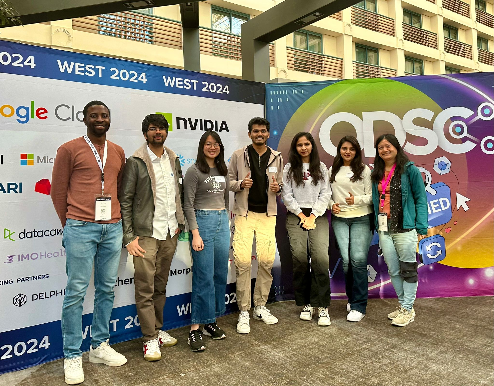
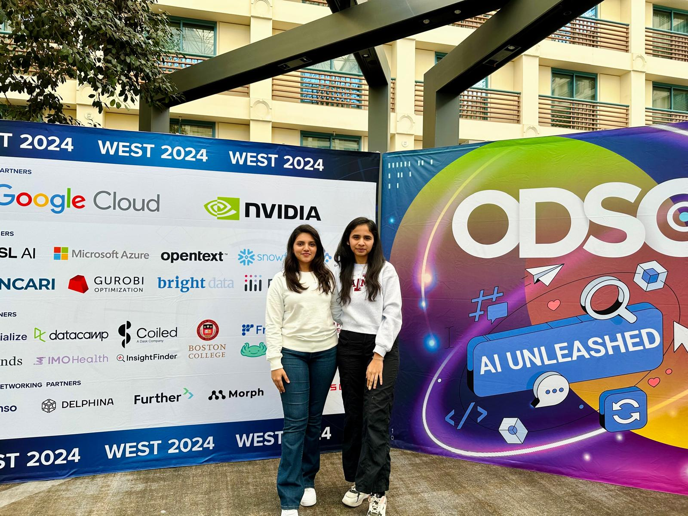
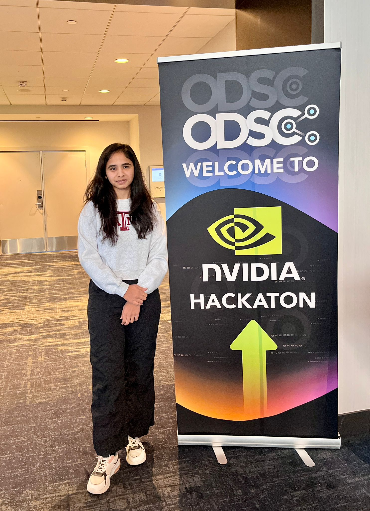

# NVIDIA-Hackathon-Accelerated-Predictive-Modeling

This project was developed as part of the NVIDIA Spooktacular Data Science Competition at ODSC West 2024, where our team ranked in the top 8 out of 45+ teams. Using NVIDIA’s RAPIDS suite on A100 GPUs, we processed and modeled an 8.52GB dataset containing 11 million samples with 106 features, optimizing for both speed and accuracy. [ODSC 2024 NVIDIA Hackathon Leaderboard on Kaggle](https://www.kaggle.com/competitions/odsc-2024-nvidia-hackathon/leaderboard)

## Project Overview
The primary goal of this project was to build a high-performing predictive model that could efficiently process a large-scale dataset within a limited runtime, using GPU-accelerated libraries provided by NVIDIA RAPIDS.

## Key Achievements
- Top 8 Ranking: Outperformed most teams, achieving a top 8 position at the NVIDIA Spooktacular Data Science Competition.
- High-Efficiency Data Processing: Successfully processed 8.52GB of data with 11 million samples in under 2 minutes.
- GPU-Accelerated Modeling: Leveraged cuDF and cuML to achieve optimal runtime of 1 minute and 55 seconds on NVIDIA's A100 GPU.

## Features
- Data Processing with cuDF: Efficient handling of large-scale tabular data, reducing I/O and preprocessing time significantly.
- Model Training with cuML: High-performance GPU-based machine learning training using RAPIDS’ cuML library.
- Hyperparameter Tuning: Utilized GridSearchCV with cuML to find optimal model parameters.

## Installation
### Prerequisites
- Python 3.8+
- NVIDIA A100 GPU (or other compatible GPU)
- CUDA Toolkit (compatible with RAPIDS)

## Results
- Runtime: Achieved a total runtime of 1 minute and 55 seconds on NVIDIA’s A100 GPU.
- Performance: Ranked in the top 8 in the NVIDIA Spooktacular Data Science Competition, ODSC West 2024.

